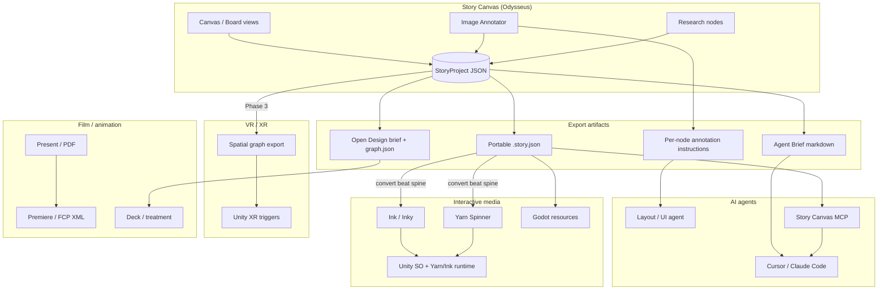

# Story Canvas Handoff Research

> **Date:** 2026-08-16  
> **Scope:** Read-only codebase audit + external research on handoff patterns from visual storyboards to games, interactive fiction, VR/XR, film pipelines, and AI agent workflows.  
> **Related:** `docs/story-canvas-open-design.md`, `openspec/changes/add-visual-story-canvas/`, `research-orch/rp-visual-storytelling-canvas-20260801/`

---

## Executive summary

- **Story Canvas already owns a renderer-independent story graph** (`GraphNode` / `GraphEdge` / `sequenceIndex`) with four synchronized views (canvas, outline, storyboard board, present), vector image annotations that compile to agent-ready edit instructions, portable JSON export, and an **Agent Brief** optimized for Cursor/Claude handoff — the highest-ROI route is to extend these artifacts rather than rebuild a narrative IDE.
- **Industry handoff converges on structured JSON graphs** (Arcweave, Articy Draft, Twine JSON, Ink JSON, Yarn `.yarnproject`) plus engine-specific importers; visual spatial layout is secondary metadata unless targeting VR/XR, where 3D triggers and zone graphs become first-class.
- **Branching narrative requires explicit edge semantics beyond today's `follows`** — competitors model choices, conditions, variables, and jumpers; Story Canvas should add optional `branch`, `choice`, and `condition` edge/node fields before targeting Ink/Yarn/Arcweave converters.
- **Agent workflows are maturing around MCP + compact briefs** (tldraw MCP App, Boords API/Agent, Agentation-style annotation MCP); Story Canvas's Agent Brief + per-node annotation copy is aligned with this pattern and should become an Odysseus MCP tool or `/handoff` skill next.
- **Recommended sequencing:** Phase 1 = Agent Brief MCP + Ink/Yarn export from beat/text subgraphs; Phase 2 = Open Design + asset routing + Unity ScriptableObject pack; Phase 3 = spatial/VR scene graph + Arcweave-compatible interchange.

---

## Current Story Canvas export surface (what we have today)

### Core data model

Canonical types live in `apps/story-canvas/src/domain.ts`:

| Field | Purpose |
|-------|---------|
| `StoryProject` | `id`, `title`, `nodes[]`, `edges[]`, `template`, `updatedAt` |
| `GraphNode` | `id`, `type`, `x`, `y`, `title`, `body`, `src`, `sequenceIndex`, `provenance`, `frameId`, `researchSessionId`, `width`, `height`, `annotations[]`, `annotationSchemaVersion` |
| `GraphEdge` | `id`, `from`, `to`, `type` |

**Node kinds:** `image`, `video`, `text`, `research`, `prompt`, `beat`, `scene`, `frame`  
**Edge kinds:** `follows`, `supports`, `references`, `visualReference`, `researchContext`

Design intent (OpenSpec D2): React Flow is an adapter; outline / board / present read the same graph ordered by `sequenceIndex`.

### Export & copy artifacts

| Artifact | Mechanism | Contents | Downstream fit |
|----------|-----------|----------|----------------|
| **Portable `.story.json`** | Export JSON / copy JSON (`portableProjectJsonString`, `inlineProjectMedia`) | Full graph + inlined media as data URLs | Universal interchange; large files when images embedded |
| **Agent Brief** | Toolbar "Agent brief" → clipboard (`buildAgentBrief`) | Markdown: project summary, node counts, selection scope, **image edit instructions** from annotations, beat sequence notes, suggested agent tasks | Cursor, Claude Code, layout/coding agents |
| **Per-node annotation instructions** | Image annotator / board card "Copy instructions" (`annotationsToInstructions`) | Numbered markdown steps with region labels, reference callouts, branding heuristics | Design implementation, slide/UI agents |
| **Export OD** | `POST /api/story-canvas/projects/{id}/export-od` | `brief.md` + `graph.json` + asset refs; optional handoff to sibling `open-design` | Deck, brand still, DESIGN.md workflows |
| **Present / Print** | Present view → Print/PDF | Linear slide sequence from `sequenceIndex` | Client review, animatic-adjacent PDF |
| **Research nodes** | Firecrawl via `/api/story-canvas/research` | Structured body: Query, Claims, Sources | Fact-checking, worldbuilding context for agents |
| **Server persistence** | `/api/story-canvas/projects` + `data/story_canvas/` | JSON projects; assets under `assets/<id>/` | Same-origin save from Odysseus iframe |

### Views as projections (not separate data)

| View | File | Projection |
|------|------|------------|
| Canvas | `App.tsx` + React Flow | Spatial graph, typed edges, frames |
| Outline | `SideViews.tsx` `OutlineView` | Ordered list by `sequenceIndex` |
| Board (storyboard) | `BoardView` | Card grid with inline edit, media replace, annotate |
| Present | `PresentView` | One node per "slide"; image/video + body text |

### Image annotation pipeline

- Vector annotations (`lib/annotationTypes.ts`): shapes (line, arrow, rect, circle) + text labels with `AnnotationStyle` (stroke, fill, background, opacity).
- Save produces **baked PNG** (`src`) **and** persisted `annotations[]` for round-trip editing.
- `annotationInstructions.ts` converts vectors → **agent-ready markdown** (region inference, reference/instruction linking, domain-specific branding templates).

### Odysseus shell integration

- Built Vite island → `static/story-canvas/`; opened from rail via `static/js/storyCanvas.js` (iframe, same-origin cookies).
- Auth exempt prefix `/api/story-canvas` so creative tool works without session friction in iframe.
- Composer modes create text / beat / prompt / research nodes; research hydrates from Odysseus research library sessions.

### Gaps (handoff blockers)

1. **`routes/story_canvas_routes.py` is empty** in workspace — client expects API contract from OpenSpec; export-od server implementation may be incomplete or elsewhere.
2. **No native branching semantics** — `follows` edges imply sequence but not player choices or conditions.
3. **No spatial 3D fields** — `x`/`y` are 2D canvas coords only.
4. **No formal schema version** on `StoryProject` JSON (only annotation schema version).
5. **No engine-specific exporters** — Ink, Yarn, Twine, Unity, etc. are manual/agent-mediated today.

---

## Information architecture patterns (external)

### Branching narrative

Tools like **Arcweave**, **Articy Draft**, and **NarrativeFlow** treat the story as a **directed graph** with:

- **Nodes:** dialogue, beat, hub, jump, variable setter, condition gate
- **Edges:** labeled choices, automatic transitions, conditional branches
- **Side data:** variables, character/item components, localization IDs
- **Export:** stable JSON as source of truth → engine plugins (Unity ScriptableObjects, Unreal DataTables, Godot resources)

Story Canvas's `beat` + `follows` + `researchContext` edges are a **linear/spine-first** subset; adding `choice` edges and `condition` metadata unlocks IF/game-engine converters.

### Spatial / immersive layout

VR/XR pipelines extend the graph with **spatial nodes**:

- World position (`x`, `y`, `z`), trigger radius, gaze/interaction type
- Audio/visual asset refs bound to zones
- Unity XR / Unreal Sequencer use scene-placed triggers driven by narrative state

Story Canvas **frame** nodes (2D bounding groups) and canvas `(x,y)` are a useful **moodboard/spatial storyboard** layer but need a `spatial` node kind or `transform3d` extension for engine handoff.

### Asset + metadata routing

Best practice (Arcweave, Articy, Boords API):

- **Separate heavy assets** from graph JSON (paths/URLs, not always inline base64)
- **Typed refs:** `visualReference` edges → image nodes as look-dev refs for beats/scenes
- **Annotation layer:** edit instructions travel as text alongside refs (matches Story Canvas Agent Brief pattern)

### Agent consumption

Emerging pattern (2025–2026):

1. **Compact brief** (≤4k chars) for chat context — Story Canvas Agent Brief
2. **Structured graph JSON** for tools/MCP — full `.story.json` or subgraph
3. **Visual annotation → text instructions** — Agentation, Story Canvas `annotationsToInstructions`
4. **MCP Apps** return interactive UI + pass canvas state back into agent context (tldraw MCP App)

---

## Handoff route options (ranked by effort / impact)

Score: **Impact** (1–5) × feasibility; **Effort** S/M/L.

| Rank | Route | Effort | Impact | Notes |
|------|-------|--------|--------|-------|
| 1 | **Agent Brief → Cursor / Claude Code** | S | ★★★★★ | **Exists today.** Selection-scoped brief + annotation blocks. Add MCP `story_canvas_brief` + validated-handoff skill wrapper. |
| 2 | **Annotation instructions → layout / UI agent** | S | ★★★★☆ | **Exists today** per image node. Pair with Open Design or Figma-like targets. |
| 3 | **Portable JSON → LLM-mediated converter** | S | ★★★★☆ | Copy JSON + prompt "emit Ink/Yarn/Unity SO" — zero code, immediate value; fragile for production. |
| 4 | **Beat subgraph → Ink (`.ink`)** | M | ★★★★☆ | Map `beat`/`text` nodes on `follows` edges to knots/stitches; compile to Ink JSON via inklecate. Good for interactive fiction / dialogue-heavy games. |
| 5 | **Beat subgraph → Yarn (`.yarn`)** | M | ★★★★☆ | Similar mapping; `.yarnproject` JSON for Unity/Godot. Mature Unity path. |
| 6 | **Export OD → deck / brand still / treatment** | M | ★★★☆☆ | Partially built; best for **marketing / pitch / film-adjacent** artifacts, not game runtime. |
| 7 | **Present view → PDF / edit-suite XML** | M | ★★★☆☆ | Print exists; add Boords/Storyboarder-style Premiere/FCP XML for previz (film pipeline). |
| 8 | **Portable JSON → Unity ScriptableObjects pack** | M–L | ★★★★☆ | Zip: `StoryGraph.asset` + textures from image nodes + edge list; importer script in game repo. |
| 9 | **Arcweave-compatible JSON export/import** | M–L | ★★★☆☆ | Enables teams already on Arcweave; bidirectional is hard; one-way export is enough for v1. |
| 10 | **Story Canvas MCP server** (graph read/write) | M | ★★★★☆ | Expose project list, get graph, append beat, export brief — mirrors tldraw MCP pattern for Odysseus-native agents. |
| 11 | **VR spatial scene graph → Unity XR** | L | ★★★☆☆ | Requires 3D coords, triggers, scene binding; high value for immersive storytelling niche. |
| 12 | **Twine / Twison JSON export** | M | ★★★☆☆ | Passage-per-node; good for web-first IF prototypes. |
| 13 | **Boords / Miro API sync** | L | ★★☆☆☆ | Agency sign-off workflows; different product surface; import-only may suffice. |

---

## Recommended phased roadmap

### Phase 1 — Quick wins (1–2 weeks)

**Goal:** Make existing artifacts agent- and engine-friendly without schema upheaval.

| Item | Deliverable |
|------|-------------|
| Agent Brief MCP | Tool: `get_story_brief(project_id, selection?)` returning markdown |
| Handoff skill | `story-canvas-handoff` skill: brief + optional JSON attachment for Cursor |
| Ink/Yarn stub exporter | CLI or `/api/.../export?format=ink` from `beat`+`text`+`follows` spine |
| Schema version | Add `schemaVersion: 1` to `StoryProject` JSON |
| Restore server routes | Implement `story_canvas_routes.py` if missing (CRUD, export-od, assets) |

### Phase 2 — Structured interchange (4–8 weeks)

**Goal:** Reliable non-agent pipelines to creative tools and game preproduction.

| Item | Deliverable |
|------|-------------|
| Branching model | Edge types `choice`, `conditional`; node fields `variables`, `conditions` |
| Asset routing | Export pack: graph JSON + `/assets/` folder manifest (no forced base64) |
| Unity exporter | ScriptableObject generator + README for game repos |
| Open Design bridge | Harden export-od; HyperFrame/video deferred per open-design spec |
| Twine JSON | Passage export for web IF prototyping |
| Present → PDF template | Branded print CSS / optional server-side PDF |

### Phase 3 — Spatial / VR & ecosystem (8+ weeks)

**Goal:** Immersive and professional pipeline integration.

| Item | Deliverable |
|------|-------------|
| Spatial extension | `transform3d`, `triggerZone`, `audioRef` on scene/beat nodes |
| Unity XR pack | Spatial graph → trigger volumes + narrative UI prefabs |
| Arcweave JSON profile | Documented mapping subset for import into Arcweave |
| Unreal Sequencer notes | Beat → level sequence marker mapping (manual/automated) |
| OpenBrush / previz | Export orthographic storyboard sheets + spatial notes for VR artists |
| Boords import | Optional: frames from API → image nodes |

---

## Data schema extensions needed

Proposed **StoryProject v2** additive fields (backward compatible):

```typescript
// Project-level
schemaVersion: 1;
locale?: string;
variables?: { name: string; type: "bool"|"number"|"string"; default?: unknown }[];

// GraphNode additions
export type NodeKind = /* existing */ | "choice" | "hub" | "spatial";

// Optional on beat | scene | text | choice
speaker?: string;
tags?: string[];
conditions?: string[];        // expression strings, e.g. "flags.met_elder"
effects?: string[];           // side effects on enter/exit
mediaRefs?: { kind: "image"|"audio"|"video"; src: string; role?: string }[];

// Spatial (VR/XR) — scene | spatial nodes
transform3d?: { x: number; y: number; z: number; rotY?: number; scale?: number };
trigger?: { type: "enter"|"gaze"|"interact"; radius?: number };

// Branching — choice nodes or beats with multiple outgoing choice edges
choices?: { id: string; label: string; targetNodeId: string; condition?: string }[];

// GraphEdge additions
export type EdgeType = /* existing */ | "choice" | "conditional" | "parallel";
label?: string;               // choice text
condition?: string;
priority?: number;
```

**Annotation handoff extension:**

```typescript
annotationsMeta?: {
  compiledInstructions?: string;  // cache of annotationsToInstructions
  targetMedium?: "web"|"slide"|"game-ui"|"vr";
};
```

**Export profiles** (manifest in export bundle):

```json
{
  "profile": "agent-brief | ink | yarn | unity-so | arcweave-subset | spatial-xr",
  "schemaVersion": 1,
  "projectId": "...",
  "generatedAt": "ISO8601"
}
```

---

## Example handoff flow diagram



---

## External tools & APIs reference

| Tool | Handoff mechanism | Best for |
|------|-------------------|----------|
| [Arcweave](https://docs.arcweave.com/introduction/whom-is-it-for/developers) | JSON export + Web API; Unity/Unreal/Godot plugins | Branching narrative, team writer/dev split |
| [Articy Draft](https://www.articy.com/en/articydraft/integration/techexports/) | JSON/XML rulesets, Unity/Unreal importers | AAA-style narrative + object database |
| [Ink](https://www.inklestudios.com/ink/) | `.ink` → JSON; Unity/Inkpot (Unreal) | Writer-programmer text narrative |
| [Yarn Spinner](https://docs.yarnspinner.dev/) | `.yarn` + `.yarnproject` JSON; Unity/Godot/Unreal | Dialogue-heavy Unity games |
| [Twine / Twison](https://twinery.org/) | Passage JSON | Web IF, rapid branching prototypes |
| [Boords](https://boords.com/docs/public-api) | REST API + webhooks; PDF/animatic export | Agency storyboard sign-off |
| [Storyboarder](https://wonderunit.com/storyboarder/) | Premiere/FCP/Avid/PDF/GIF | Film previz, animatics |
| [tldraw MCP App](https://tldraw.dev/blog/tldraw-mcp-app) | MCP tools + canvas state in agent context | Agent/visual collaboration pattern |
| [Open Design](https://github.com/Tylarcam/open-design) (sibling) | DESIGN.md, deck, image artifacts | Brand-grade outputs from story graph |
| [NarrativeFlow / Storyflow](https://storyflow-editor.com/blog/best-narrative-design-tools-for-game-developers-2025/) | JSON + multi-engine interpreters | Comparative benchmark for graph-first tools |

### Film / animation pipeline notes

- **Figma → After Effects:** plugins (Convertify, AEUX) transfer artboards as layers — analogous to exporting Story Canvas board cards as layered stills.
- **Storyboard → previz:** Storyboarder exports edit-decision-friendly formats; Boords adds API-driven automation — Story Canvas Present + timed beat metadata could target similar XML.
- **Lottie / motion handoff:** design animation specs as JSON — optional future export from annotated image nodes (timing in beat body).

### VR / XR narrative notes

- **Spatial Stories toolset** (Voices of VR #606): point-and-click authoring for immersive storytellers — conceptually similar to spatial node triggers.
- **Unity XR worldbuilding ebook:** scene-based beats with environmental storytelling — map `scene` nodes to Unity sub-scenes.
- **OpenBrush / Tilt Brush:** VR sketches as reference art → import as image nodes with `visualReference` edges to beats (already supported).

---

## Agent / handoff workflow recommendations

1. **Default handoff packet for coding agents**
   - Agent Brief (selection-scoped if partial work)
   - Attach portable JSON only when structural edits required
   - Per-image annotation blocks for any UI/layout task

2. **Validated handoff skill** (align with `validated-handoff` skill)
   - Verify node ids referenced in brief exist in JSON
   - Flag orphan nodes / missing media before agent run

3. **MCP tools (proposed)**
   - `story_canvas_list_projects`
   - `story_canvas_get_graph(project_id)`
   - `story_canvas_get_brief(project_id, node_ids?)`
   - `story_canvas_export(project_id, format: ink|yarn|json)`

4. **Do not** auto-mutate canvas from agents without explicit accept (product principle from rp-visual-storytelling-canvas research).

---

## Sources

### Codebase
- `apps/story-canvas/src/domain.ts` — graph model
- `apps/story-canvas/src/agentBrief.ts` — Agent Brief builder
- `apps/story-canvas/src/annotationInstructions.ts` — annotation → markdown
- `apps/story-canvas/src/api.ts` — export/import/portable JSON
- `apps/story-canvas/src/views/SideViews.tsx` — outline/board/present
- `docs/story-canvas-open-design.md` — OD bridge
- `openspec/changes/add-visual-story-canvas/design.md` — architecture decisions
- `research-orch/rp-visual-storytelling-canvas-20260801/master_report.md` — product research baseline

### External
- [Arcweave for Developers](https://docs.arcweave.com/introduction/whom-is-it-for/developers)
- [Arcweave JSON integration](https://docs.arcweave.com/integrations/json)
- [Articy JSON exports](https://www.articy.com/help/Exports_JSON.html)
- [Ink narrative language](https://www.inklestudios.com/ink/)
- [Yarn Spinner docs](https://docs.yarnspinner.dev/)
- [Boords Public API](https://boords.com/docs/public-api)
- [Boords Webhooks](https://boords.com/docs/webhooks)
- [Storyboarder (Wonder Unit)](https://wonderunit.com/storyboarder/)
- [tldraw MCP App announcement](https://tldraw.dev/blog/tldraw-mcp-app)
- [Best Narrative Design Tools 2026 (Storyflow)](https://storyflow-editor.com/blog/best-narrative-design-tools-for-game-developers-2025/)
- [Unity XR worldbuilding ebook](https://unity.com/blog/worldbuilding-xr-free-technical-ebook)
- [Voices of VR — Spatial Stories toolset](https://voicesofvr.com/606-workflow-for-interactive-narratives-with-spatial-stories-toolset/)
- [Agentation — UI feedback for coding agents](https://medium.com/design-bootcamp/how-agentation-helps-ai-coding-agents-understand-ui-feedback-960ee81b9798)

---

## Appendix: Mapping Story Canvas → Ink (illustrative)

```
beat node "Intro" body → knot Intro
  follows edge → stitch or divert
text node with body → line of dialogue
researchContext edge → comment ;; research ref
visualReference edge → TODO: tag for art direction
choice edge (future) → * [label] -> target
```

This mapping is sufficient for a Phase 1 exporter prototype without changing the canvas UI.
