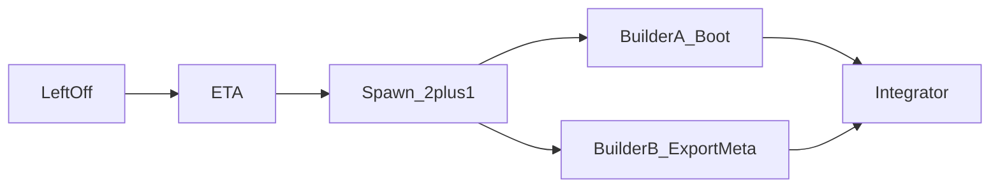

# Left-off + ETA + agent cluster (Screenpipe 3h)

## Where they left off

**Session:** `d9b78c4e-bfd0-44e4-92fb-ffbbec23027a` (odysseus, 2026-07-11 ~10:32)

**Shipped / done:**
- Screenpipe content-type / field map (docs + local fork + Odysseus export)
- First-pass 3h session-ops prompt + this review pack

**Stopped before:**
1. Live `:3030` capture restored and re-sampled
2. `:30001` PixelRAG serve restored
3. Export wiring for `browser_url` / accessibility
4. FAISS freshness vs new tiles

**Out of scope for this cluster:**
- Handshake submit (`1063753d`)
- Voice.ai / Local STT feature work (already shipped)

**Concrete next files:**
- `deploy/scripts/start-screenpipe.ps1`
- `deploy/scripts/start-archivist.ps1`
- `tools/export_screenpipe.py`
- `tools/build_tiles.py`
- `memory_stack.env`
- `docs/archivist-external-deps.md` (ops notes only if docs drift)

---

## Intensity-weighted ETA

| Workstream | Intensity (1–5) | Solo ETA | Notes |
|------------|-----------------|----------|-------|
| A — Restart Screenpipe + PixelRAG + health matrix | 2 | 0.3–0.6h | Ops; no FAISS rebuild |
| B — Export freshness + NonInteractive archivist wiring | 2 | 0.5–1.0h | `start-archivist.ps1` + export smoke |
| C — `browser_url` / window metadata in export→tiles | 3 | 1.0–1.5h | Depends on fields local API actually returns |
| Integrator — doctor checklist + mark UNDONE | 1 | 0.3h | Probe ports + newest timestamp |

**Wall clock (parallel):** ~1.5–2.0h (max of A∥B then C/integrate — or A∥C if boot done first)

---

## Agent spawn (cap 2 builders + 1 integrator)

### Agent A — Boot / health

- **Resume context (files only):** `deploy/scripts/start-screenpipe.ps1`, `deploy/scripts/start-archivist.ps1`, `tools/pixelrag_serve_quiet.py`, `memory_stack.env` — do **not** re-read full transcript
- **Do:** Start Screenpipe `-NonInteractive`; start PixelRAG quiet on `:30001`; write health matrix for 3030/30001/40001
- **Do not:** Rebuild FAISS; enable Screenpipe audio; touch Handshake/voice code
- **Done when:** All three health endpoints respond; note audio_status
- **Paste prompt:**

`Resume odysseus from d9b78c4e left-off only (do not re-read full transcript). Restart Screenpipe with start-screenpipe.ps1 -NonInteractive and PixelRAG via tools.pixelrag_serve_quiet on :30001 using existing my_index. Probe /health on :3030 :30001 :40001. Touch ≤3 files only if NonInteractive wiring is missing in start-archivist.ps1. Done when: health matrix written to session-review-3h-screenpipe/BOOT-HEALTH.md.`

### Agent B — Export metadata gap

- **Resume context (files only):** `tools/export_screenpipe.py`, `tools/build_tiles.py`, sample under `data/archivist/screenpipe/transcripts/` — do **not** re-read full transcript
- **Do:** Map `browser_url` / richer window title when API provides them; keep empty if absent; smoke one export
- **Do not:** Change Screenpipe Rust fork; do not enable audio; do not rebuild full tile set unless needed for one sample
- **Done when:** Metadata schema documents url source; sample shows http url **or** explicit none-found from live API fields
- **Paste prompt:**

`Resume odysseus from d9b78c4e left-off only (do not re-read full transcript). In tools/export_screenpipe.py (and build_tiles if needed), plumb browser_url/window_name into transcript JSON + tiles_metadata when present on /search rows. Touch ≤3 files. Done when: one exported row shows non-empty url OR a short NOTE that local API OCRContent lacks those fields.`

### Agent C — Integrator

- **Resume context (files only):** `session-review-3h-screenpipe/UNDONE-TASKS.md`, `BOOT-HEALTH.md`, export summary JSON
- **Do:** Confirm #1–#3; run export limit=50; record newest timestamp; update UNDONE checkboxes in a RESULT note
- **Do not:** Start new features; do not ingest full transcripts
- **Done when:** RESULT notes newest capture age < 15m after boot **or** explains why still stale
- **Paste prompt:**

`Integrate Screenpipe 3h P0: read BOOT-HEALTH.md + export summary only. Run python -m tools.export_screenpipe --limit 50. Update session-review-3h-screenpipe/P0-RESULT.md with ports, rows_fetched, newest timestamp, open UNDONE ids. Do not re-read full transcript.`
